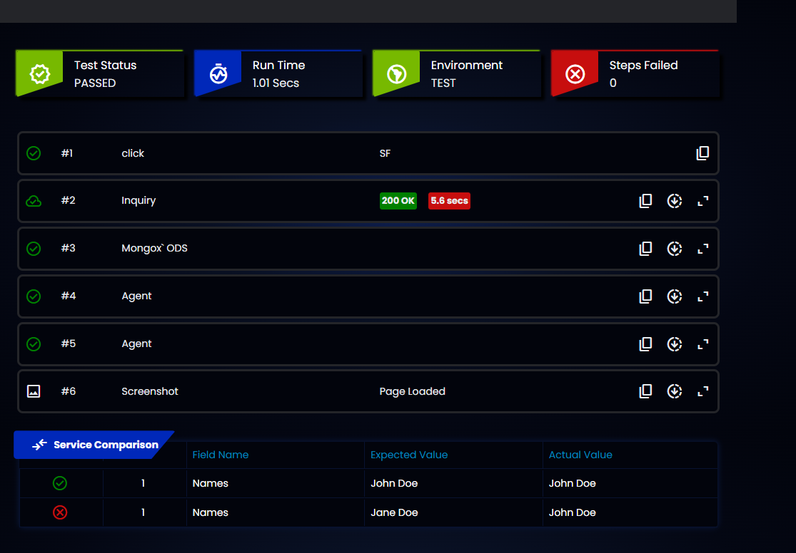

# wdio-html-dark-reporter v2 changes
## Usage(CJS)
Wdio.conf.js

importing:
```sh
const CustomReporter = require("wdio-html-dark-reporter");
```
Under reporters section:
```sh
    reporters: ['spec','dot',[CustomReporter, {
        outputFolder: '',
        excludedCommands:[],
        theme:'nvidia'
    }]],
```

## Currently available events

```sh
await process.emit("add-test-step", {
          status: "pass",
          command: "click",
          fieldName: "SF",
          additionalInfo: '//h1[@title="xpath"]',
        });
        process.emit("add-test-step-api", {
          status: "pass",
          serviceName: "Google",
          metaDataMetrics: [{ value: "200 OK", status: "pass" }],
          additionalInfo: "",
          endpoint: "https://www.google.com",
          requestHeaders: JSON.stringify(
            { "content-type": "application/json" },
            null,
            1
          ),
          requestBody: JSON.stringify({ name: "reporter" }, null, 1),
          responseHeaders: JSON.stringify(
            { "content-type": "application/json" },
            null,
            1
          ),
          responseBody: JSON.stringify({ myResp: "success" }, null, 1),
        });
        process.emit("add-test-step-payload", {
          status: "pass",
          serviceName: "Mongo",
          metaDataMetrics: [{ value: "success", status: "pass" }],
          additionalInfo: "",
          info: "db query here",
          payload: JSON.stringify({ myResp: "success" }, null, 1),
        });
        process.emit("add-test-step-payload", {
          status: "pass",
          serviceName: "Agent",
          metaDataMetrics: [{ value: "success", status: "fail" }],
          additionalInfo: "",
          info: "db query",
          payload: "<agent><name>AGENT</name></agent>",
        });
        process.emit("add-test-step-payload", {
          status: "pass",
          serviceName: "Agent",
          metaDataMetrics: [{ value: "success", status: "fail" }],
          additionalInfo: "",
          info: "db query",
          payload: "<agent><name>Arav</name></agent>",
        });
        let screenshotPath = await browser.saveScreenshot(global.currentTestScreenshotPath+"Page_Loaded.png")
        console.log("screenshotPath===",global.currentTestScreenshotPath)
        await process.emit("add-test-step-image", {
          screenshotName: "Page Loaded"
        });
        let tableUUID = uuidv4();
        await process.emit("create-test-table",{tableUUID: tableUUID, tableName: "Service", tableHeaders: ["Field Name", "Actual Value", "Expected Value"]});
        await new Promise(resolve => {
          process.once("create-test-table-done", resolve);
        });
        
        await process.emit("create-test-table-row",{tableUUID: tableUUID, testStatus: 'pass', tableRowData:["Names", "John Doe", "John Doe"]});
        await process.emit("create-test-table-row",{tableUUID: tableUUID, testStatus: 'fail', tableRowData:["Names", "Jane Doe", "John Doe"]});
        console.log("spec completed");
```

- Sample screenshot of v2
- 

